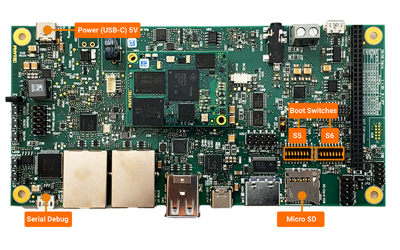

% IoT.bzh - Tips and tricks - Build the Phytec BSP
% Valentin Geffroy - <valentin.geffroy@iot.bzh>
% September, 18th 2024

__Goal:__ give clues to build, test or upgrade your BSP (~1h30)

## Summary - What are we going to do together?

1. Find which BSP version you're looking for
2. Build BSP components locally (only the bootloader if you want)
3. Package the BSP in redpesk Factory to build your image
4. BONUS: customize your BSP with patches for example

## Requirements - Please check all of these items!

- Power the board (check the specs/box, there is 5V power supply)
- Debug UART (see reference X49 written on the PCB) with a USB cable
- Have minicom or picocom on your computer (only for Linux. For Windows, you can install PuTTY)
- Get GCC toolchains for aarch64/arm32 U-Boot builds (gcc-aarch64-linux-gnu & gcc-arm-linux-gnu)

*NOTE: get the ARM toolchain SDK [here](https://developer.arm.com/downloads/-/gnu-a) or by using your package manager*



## 1) First step: which BSP version?

According to Valeo needs, we're looking to this [Yocto branch](https://docs.phytec.com/projects/yocto-phycore-am62x/en/bsp-yocto-ampliphy-am62x-pd23.2.1/releasenotes/pd23.2.1.html) version.

It goes with some very interesting information:

| BSP component         | Version                                                   | Link                                                                                                              |
|-----------------------|-----------------------------------------------------------|-------------------------------------------------------------------------------------------------------------------|
| **Linux Kernel**      | v6.1.69-09.02.00.005 (tag: v6.1.69-09.02.00.005-phy3)     | [PHYTEC Linux kernel repository](https://github.com/phytec/linux-phytec-ti/tree/v6.1.69-09.02.00.005-phy3)        |
| **U-Boot Bootloader** | v2023.04 (tag: v2023.04-09.02.00.005-phy2)                | [PHYTEC U-Boot bootloader repository](https://github.com/phytec/u-boot-phytec-ti/tree/v2023.04-09.02.00.005-phy2) |
| **Yocto**             | 4.0.16 Kirkstone (tag: BSP-Yocto-Ampliphy-AM62x-PD23.2.1) | [PHYTEC Meta Layer repository](https://git.phytec.de/meta-phytec/tree/?h=BSP-Yocto-Ampliphy-AM62x-PD23.2.1)       |

So we have our references which contain code sources, documentation and patches!
It will be very useful later especially for packaging.

*NOTE: You can identify which board version you have by looking to the PCB [identification numbers](https://docs.phytec.com/projects/yocto-phycore-am62x/en/bsp-yocto-ampliphy-am62x-pd23.2.1/releasenotes/pd23.2.1.html#part-number-summary).*

## 2) Second step: BSP build on your laptop & tests on the board

Oh! I found a VERY COOL [documentation](https://software-dl.ti.com/processor-sdk-linux/esd/AM62X/09_00_00_03/exports/docs/linux/Foundational_Components/U-Boot/UG-General-Info.html) (yes, the board/SOC vendor is ALWAYS the only truth to follow).

Oh Oh! Prebuilt binaries are [here](https://download.phytec.de/Software/Linux/BSP-Yocto-AM62x/BSP-Yocto-Ampliphy-AM62x-PD23.2.1/images/ampliphy-xwayland/phyboard-lyra-am62xx-3/).
There could be very useful for testing purposes.

### Build on your laptop | U-Boot bootloader

- Please install the following packages:

```
flex bison bc dtc gnutls python3-setuptools swig
```

- Clone Phytec repo which contains sources

```
git clone https://github.com/phytec/u-boot-phytec-ti.git -b v2023.04-09.02.00.005-phy2
git clone https://github.com/ARM-software/arm-trusted-firmware.git -b v2.10.0
git clone https://git.ti.com/git/processor-firmware/ti-linux-firmware.git -b ti-linux-firmware
git clone https://github.com/OP-TEE/optee_os.git -b 4.3.0
```

- Get absolute paths for each BSP component (will be useful later...)

```
export UBOOT_DIR=$(realpath u-boot-phytec-ti)
export TFA_DIR=$(realpath arm-trusted-firmware)
export TI_LINUX_FW_DIR=$(realpath ti-linux-firmware)
export OPTEE_DIR=$(realpath optee_os)
```

- ARM Trusted Firmware build (for bl31.bin which is a required binary to build U-Boot on ARM SoCs). Link to doc [here](https://software-dl.ti.com/processor-sdk-linux/esd/AM62X/09_00_00_03/exports/docs/linux/Foundational_Components_ATF.html#foundational-components-atf).

```
cd $TFA_DIR
make ARCH=aarch64 CROSS_COMPILE=aarch64-linux-gnu- PLAT=k3 TARGET_BOARD=lite SPD=opteed
```

It has created the `bl31.bin` here: `$TFA_DIR/build/k3/lite/release/bl31.bin` that we'll use later.

- Please understand that OP-TEE isn't important to us because we don't want low security leveling (e.g TrustZone). But OP-TEE is required for U-Boot build. Link to doc [here](https://software-dl.ti.com/processor-sdk-linux/esd/AM62X/09_00_00_03/exports/docs/linux/Foundational_Components_OPTEE.html#foundational-components-optee).

```
cd $OPTEE_DIR
make CROSS_COMPILE64=aarch64-linux-gnu- CROSS_COMPILE=arm-linux-gnu- PLATFORM=k3-am62x CFG_ARM64_core=y -j
```

It has created the `tee-pager_v2.bin` here: `$OPTEE_DIR/out/arm-plat-k3/core/tee-pager_v2.bin` that we'll use later.

- Build R5 binary

```
cd $UBOOT_DIR
make ARCH=arm CROSS_COMPILE=arm-linux-gnu- phycore_am62x_r5_defconfig O=$UBOOT_DIR/out/r5
make ARCH=arm CROSS_COMPILE=arm-linux-gnu- O=$UBOOT_DIR/out/r5 BINMAN_INDIRS=$TI_LINUX_FW_DIR -j
```

When finished, it has built `out/r5/tiboot3.bin` binary used for ARM Cortex-R5 initialization.

- Build A53 binary

```
make ARCH=arm CROSS_COMPILE=aarch64-linux-gnu- phycore_am62x_a53_defconfig O=$UBOOT_DIR/out/a53
make ARCH=arm CROSS_COMPILE=aarch64-linux-gnu- BL31=$TFA_DIR/build/k3/lite/release/bl31.bin TEE=$OPTEE_DIR/out/arm-plat-k3/core/tee-pager_v2.bin O=$UBOOT_DIR/out/a53 BINMAN_INDIRS=$TI_LINUX_FW_DIR -j
```

When finished, it has build `out/a53/tispl.bin` and `out/a53/u-boot.img` binaries used for ARM Cortex-A53 initialization.

Please look at these [explanations](https://software-dl.ti.com/processor-sdk-linux/esd/AM62X/09_00_00_03/exports/docs/linux/Foundational_Components/U-Boot/UG-General-Info.html#image-formats) about U-Boot's image format and bootflow to understand these binaries functions.

### Flash the bootloader to the board

Since we have our three necessary boot components, we can flash a SD card!

For the HS-FS Phytec model here where are essential boot components:

- tiboot3-am62x-hs-fs-evm.bin (aka tiboot3.bin) from `$UBOOT_DIR/out/r5`
- tispl.bin, u-boot.img from `$UBOOT_DIR/out/a53`

Please note that when the CPU is booting, it loads binaries from the `W95 FAT32 (LBA)` partition with a /boot label.

*NOTE: If you want to understand why the ROM code is looking to this specific partition type, you can find that on the AM62x SOC [documentation](https://www.ti.com/lit/pdf/spruiv7) (chapter _Boot modes_ - page 491/15863).*

We'll using `fdisk`, which is very useful for partitioning, to create our `W95 FAT32 (LBA)` partition.

- Firstly take your SD card, erase it (with `gparted` for example, using `dd`, `fdisk` or others...) and identify the device!

```
valentin@Lenovo-T490:~$ lsblk
NAME        MAJ:MIN RM   SIZE RO TYPE MOUNTPOINTS
sda           8:0    1  29.1G  0 disk 
zram0       252:0    0     8G  0 disk [SWAP]
nvme0n1     259:0    0 476.9G  0 disk 
|-nvme0n1p1 259:1    0   512M  0 part /boot/efi
|-nvme0n1p2 259:2    0     1G  0 part /boot
`-nvme0n1p3 259:3    0 475.4G  0 part /
```

- I have `/dev/sda` which is my SD card dedicated for my redpesk image. Let's format it!

```
sudo fdisk /dev/sda

Command (m for help): n
Partition type
   p   primary (0 primary, 0 extended, 4 free)
   e   extended (container for logical partitions)
Select (default p): p
Partition number (1-4, default 1): 1
First sector (2048-61078527, default 2048): 
Last sector, +/-sectors or +/-size{K,M,G,T,P} (2048-61078527, default 61078527): 

Created a new partition 1 of type 'Linux' and of size 29.1 GiB.
```

- Your partition will be created but we have to change the partition type:

```
Command (m for help): t
Selected partition 1
Hex code or alias (type L to list all): 0x0C
Changed type of partition 'Linux' to 'W95 FAT32 (LBA)'.
```

- Then you have to add the bootable flag (needed for booting from SD card):

```
Command (m for help): a
Selected partition 1
The bootable flag on partition 1 is enabled now.
```

- Save to apply the changes:

```
Command (m for help): w
The partition table has been altered.
Calling ioctl() to re-read partition table.
Syncing disks.
```

- Last step is to create a FAT32 file system:

```
sudo mkfs.vfat -F 32 /dev/sda1
```

You can flash your SD card by copying these image binaries above to the partition.

```
sudo mount /dev/sda1 /mnt
sudo cp $UBOOT_DIR/out/r5/tiboot3.bin \
        $UBOOT_DIR/out/a53/tispl.bin \
        $UBOOT_DIR/out/a53/u-boot.img \
        /mnt && sync
```

Annnnd it's booting! Yeah!

```
U-Boot SPL 2023.04 (Sep 13 2024 - 13:35:42 +0200)
SYSFW ABI: 4.0 (firmware rev 0x000a '10.0.8--v10.00.08 (Fiery Fox)')
SPL initial stack usage: 13384 bytes
Trying to boot from MMC2
Authentication passed
Authentication passed
Authentication passed
Authentication passed
Authentication passed
Starting ATF on ARM64 core...

NOTICE:  BL31: v2.10.0	(release):v2.10.0
NOTICE:  BL31: Built : 11:48:46, Sep 13 2024
I/TC: 
I/TC: OP-TEE version: 4.3.0 (gcc version 14.1.1 20240507 (Red Hat Cross 14.1.1-1) (GCC)) #1 Fri Sep 13 10:04:06 UTC 2024 aarch64
I/TC: WARNING: This OP-TEE configuration might be insecure!
I/TC: WARNING: Please check https://optee.readthedocs.io/en/latest/architecture/porting_guidelines.html
I/TC: Primary CPU initializing
I/TC: GIC redistributor base address not provided
I/TC: Assuming default GIC group status and modifier
I/TC: SYSFW ABI: 4.0 (firmware rev 0x000a '10.0.8--v10.00.08 (Fiery Fox)')
I/TC: HUK Initialized
I/TC: Activated SA2UL device
I/TC: Enabled firewalls for SA2UL TRNG device
I/TC: SA2UL TRNG initialized
I/TC: SA2UL Drivers initialized
I/TC: Primary CPU switching to normal world boot

U-Boot SPL 2023.04 (Sep 13 2024 - 13:36:33 +0200)
SYSFW ABI: 4.0 (firmware rev 0x000a '10.0.8--v10.00.08 (Fiery Fox)')
SPL initial stack usage: 1840 bytes
Trying to boot from MMC2
Authentication passed
Authentication passed


U-Boot 2023.04 (Sep 13 2024 - 13:36:33 +0200)

SoC:   AM62X SR1.0 HS-FS
Model: PHYTEC phyBOARD-Lyra AM625
DRAM:  2 GiB
Core:  73 devices, 32 uclasses, devicetree: separate
MMC:   mmc@fa10000: 0, mmc@fa00000: 1
Loading Environment from MMC... *** Warning - bad CRC, using default environment

In:    serial@2800000
Out:   serial@2800000
Err:   serial@2800000
Net:   eth0: ethernet@8000000port@1
Hit any key to stop autoboot:  0 
21142016 bytes read in 888 ms (22.7 MiB/s)
58615 bytes read in 12 ms (4.7 MiB/s)
Working FDT set to 88000000
SoM: PCM-071-5432DE11I.A0 PCB rev: 2 
Found 0 extension board(s).
## Flattened Device Tree blob at 88000000
   Booting using the fdt blob at 0x88000000
Working FDT set to 88000000
   Loading Device Tree to 000000008feee000, end 000000008fffffff ... OK
Working FDT set to 8feee000

Starting kernel ...
```

So we have seen how to build the bootloader. We have seen how to flash a SD card to test our U-Boot.

*NOTE: if you want to use an eMMC, you can follow the flashing [procedure](https://docs.phytec.com/projects/yocto-phycore-am62x/en/bsp-yocto-ampliphy-am62x-pd23.2.1/installos/flashEMMC.html)!*

Next step is to create our redpesk OS image through the redpesk Factory a.k.a our aquarium project's stack.

## 3) Third step: packaging & image build in redpesk Factory

Please understand that we're going to package our BSP components to packages called RPM.

*NOTE: **Demo together in redpesk aquarium***

### U-Boot packaging

No magic, take a U-Boot specfile template or do your own!

An example [here](https://download.redpesk.bzh/redpesk-lts/batz-2.0-update/packages/beagleplay-bsp/source/tree/Packages/u/) with the same version.

### Kernel packaging

No magic, take a Linux kernel specfile template or do your own (good luck soldier)!

An example [here](https://download.redpesk.bzh/redpesk-lts/batz-2.0-update/packages/beagleplay-bsp/source/tree/Packages/k/) with a nearly kernel version.

### ARM Trusted Firmware packaging

No magic, take a ATF specfile template or do your own!

An example [here](https://download.redpesk.bzh/redpesk-lts/batz-2.0-update/packages/beagleplay-bsp/source/tree/Packages/a/) for the BeaglePlay which has almost the same SOC.

### TI Linux firmware packaging

No magic, take a specfile template or do your own!

An example [here](https://download.redpesk.bzh/redpesk-lts/batz-2.0-update/packages/beagleplay-bsp/source/tree/Packages/t/) for the BeaglePlay which has almost the same SOC.

### Image creation

When all BSP packages are building without errors, we'll use a [kickstart](https://github.com/redpesk-infra/rp-kickstarts) to make our own image.
For more details, everything is documented [here](https://docs.redpesk.bzh/docs/en/master/redpesk-factory/images-management/01-create-an-image.html)!

## 4) BONUS: customize the BSP with your own patches

Steps to do that:

- First fork U-Boot to obtain the source code and modify the source code
- We add our BSP patch (if needed)
- Modify some configs via `make menuconfig`
- Create the patch using `git patch`
- Add it into the application U-Boot of our BSP project
- Modify the specfile to add the new patch (> Patch1000)
- Build with the NVR which has been incremented
- Then create the new image which will contain your new patch

Easy to do, isn't it? Next step is to test your changes on the board!

## Final word

*Please note it's my workflow based on my experience. There are others ways to do tests or build your BSP (like using rp-cli tool).*
